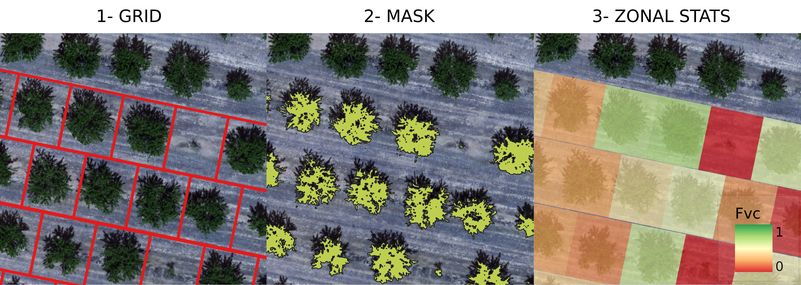

# UAV Biophysical Traits Extraction

## Objective

This project generates useful biophysical traits from UAV images to estimate parameters such as LAI (Leaf Area Index), fIPAR (Fraction of Incoming Photosynthetically Active Radiation), and to calculate crop transpiration using models like TSEB (Two-Source Energy Balance) or 3SEB (Triple-Source Energy Balance). It is especially useful for woody crops. The project consists of three main functions:

1. **Grid Generation**: Generates a grid for each individual tree, enabling a detailed analysis of tree-specific attributes.
2. **Mask Creation**: Generates masks for different crop types, soil, or canopy cover using RGB or multispectral or height images. It can process both height and multispectral data simultaneously.
3. **Zonal Statistics**: Extracts data from the generated grids by using multispectral, height, and temperature images to derive structural traits, vegetation indices (VIs), and temperature-related traits.

The extracted data includes:

### Structural Traits:
- **Fvc** (Fractional Green Cover): A float representing the fractional green cover, expressed as a percentage (%/100).
- **Hc** (Vegetation Height): A float representing the vegetation height in meters, with additional statistics (e.g., mean, max, min, std).
- **Ac** (Vegetation Zenithal Area): A float representing the zenithal area of the vegetation in square meters.
- **Vc** (Vegetation Volume): A float representing the vegetation volume in cubic meters.
- **Wc** (Vegetation Width): A float representing the vegetation width in meters, with statistics. Extracted only for woody crops.
- **Hc/Wc** (Height-to-Width Ratio): A float representing the ratio between the maximum height (Hc) and width (Wc) of vegetation (optional), extracted only for woody crops.

### Vegetation Index (VI) Traits:
- **VI**: A list of floats representing the calculated vegetation indices based on the specified options.

### Land Surface Temperature (LST) Traits:
- **Tc** (Vegetation Temperature): A float representing the temperature of the vegetation (K).
- **Trad** (Radiometric Temperature): A float representing the radiometric temperature (K).
- **Ts** (Soil Temperature): A float representing the temperature of the soil (K). Included only if a soil mask is provided.
- **Tvc** (Vegetation Cover Temperature): A float representing the temperature of the vegetation cover (K). Included only if a vegetation cover mask is provided.


## How to Use

Each function is explained in detail in the respective source code, where all parameters and their default values are outlined. To run the functions, configure the parameters according to your specific dataset and requirements, and execute them in the correct order as described in the documentation.

For more information, please check the individual function source code.

### - workflow


## Folder Structure

The project is structured as follows:

- **config/**: Contains configuration files for processing parameters, such as grid size, image files, etc.
- **processing/**: Contains the main processing functions for grid creation (`grid_processing`), mask application (`mask_processing`), and zonal statistics calculation (`zonalstats_processing`).
- **utils/**: Utility functions for common tasks like calculating vegetation indices.
- **main.py**: Main script that orchestrates the entire data processing pipeline using the functions defined in the other modules.

## Installation

To use this project, ensure you have Python 3.x installed. Then, clone the repository and install the required dependencies.

1. Clone the repository:
   ```bash
   git clone https://github.com/cesar-minuesa/uav-biophysical-extraction.git


2. Install dependencies:
   ```bash
   pip install -r requirements.txt
   conda env --create -f uav-data-processing.yml
   conda env update -f uav-data-processing.yml


## Requirements

This project requires the following Python libraries:

- `pandas`
- `geopandas`
- `shapely`
- `numpy`
- `rasterio`
- `fiona`
- `PIL`
- `rasterstats`
- `skimage`


## Main Scientific References

- Gao, R., Torres-Rua, A., Aboutalebi, M., White, W., Anderson, M., Kustas, W., Agam, N., Alsina, M., Alfieri, J., Hipps, L., Dokoozlian, N., Nieto, H., Gao, F., McKee, L., Prueger, J., Sanchez, L., Mcelrone, A., Bambach-Ortiz, N., Coopmans, C., and Gowing, I.: LAI estimation across California vineyards using sUAS multi-seasonal multi-spectral, thermal, and elevation information and machine learning, Irrigation Sci., 40, 731–759, https://doi.org/10.1007/s00271-022-00776-0, 2022. 
- Quintanilla-Albornoz, M., Miarnau, X., Pelechá, A., Casadesús, J., García-Tejera, O., and Bellvert, J.: Evaluation of transpiration in different almond production systems with two-source energy balance models from UAV thermal and multispectral imagery, Irrigation Sci., https://doi.org/10.1007/s00271-023-00888-1, 2023. 

 
### Notes:

1. **Structure Overview**: I added a project structure section to make it clear where each component fits in your project. You can adapt it depending on your actual file names and directories.
2. **Installation**: The README describes how to set up the environment and install dependencies using Conda or pip.
3. **Usage**: It provides an overview of how to use the main functions and mentions that detailed usage can be found in the `main.py` file.

This `README.md` can be placed directly in your GitHub repository, and it will help users understand the purpose of the project, how to set it up, and how to use it.


## Contact

For issues or feature requests, please contact: [cesar.minuesa@irta.cat].